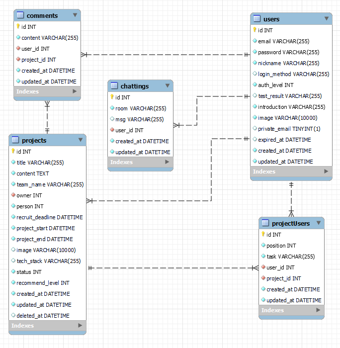
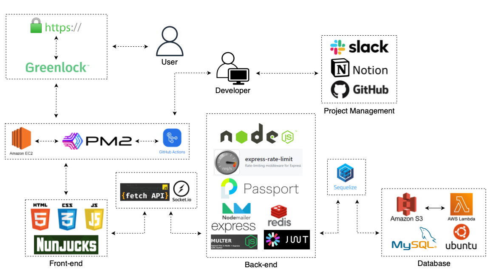

<div align=center>


<div align=left>

# 📌목차

1. [📄프로젝트 설명](#-프로젝트-설명)
2. [📚기술 스택📚](#-기술-스택-)
3. [👥멤버](#-멤버)
4. [🏗️ERD](#%EF%B8%8F-erd)
5. [🔧아키텍쳐](#-아키텍쳐)
   - [⚙️서비스](#%EF%B8%8F-서비스)
   - [📂디렉토리 구조](#-디렉토리-구조)
6. [💬기술적 의사결정](#-기술적-의사결정)
7. [⚠️트러블 슈팅](#%EF%B8%8F-트러블-슈팅)
8. [🎥시연 영상](#-시연-영상)

</div>

# 📄 프로젝트 설명

### 사이드 프로젝트 모집 사이트

#### 개발자로 성장하면서 접할 수 있는 사이드 프로젝트를 플랫폼 내에서 모두 관리 하는 것이 이번 프로젝트의 컨셉

[NoAFK 팀 노션](https://radical-musician-f09.notion.site/c86b38a0f7a6408eb31c70c2803404ea)<br>
[NoAFK 사이트](https://noafk.site/)

# 📚 기술 스택 📚

### ⭐ Platforms & Languages ⭐

### Front End

  
  
  
  

### Back End

  
  
  
  
  
  
  
  
  <br>
  
  
  
  
  <br>
  <p><h2>☁️ AWS ☁️</h2></p>
	
	
	
  <br>
	
  <br>
  <p><h2>🛠️ Tools 🛠️</h2></p>
	
	
  <br>
	
  
  <br>
	
  <br>
<br>

# 👥 멤버

  <a href="https://github.com/Jeongjiw00">
    
  </a>
  <a href="https://github.com/rsl150101">
    
  </a>
  <a href="https://github.com/go-tiger">
    
  </a>
  <a href="https://github.com/Kyeongjin-Park">
    
  </a>
  <a href="https://github.com/MintZzz1009">
    
  </a>

# 🏗️ ERD

  

# 🔧 아키텍쳐

## ⚙️ 서비스

  

## 📂 디렉토리 구조

<div align=left>

<details>
  <summary>구조 보기</summary>

```
📦NoAFK
 ┣ 📂src
 ┃ ┣ 📂config
 ┃ ┃ ┗ 📜config.js
 ┃ ┣ 📂controllers
 ┃ ┃ ┣ 📜api.controller.js
 ┃ ┃ ┣ 📜chats.controller.js
 ┃ ┃ ┣ 📜comments.controller.js
 ┃ ┃ ┣ 📜projects.controller.js
 ┃ ┃ ┣ 📜teams.controller.js
 ┃ ┃ ┗ 📜users.controller.js
 ┃ ┣ 📂middlewares
 ┃ ┃ ┣ 📜auth.js
 ┃ ┃ ┗ 📜uploads.js
 ┃ ┣ 📂migrations
 ┃ ┃ ┣ 📜20230228073808-create-user.js
 ┃ ┃ ┣ 📜20230228074008-create-project.js
 ┃ ┃ ┣ 📜20230228075312-create-chatting.js
 ┃ ┃ ┣ 📜20230228075356-create-comment.js
 ┃ ┃ ┗ 📜20230228075512-create-project-user.js
 ┃ ┣ 📂models
 ┃ ┃ ┣ 📜chatting.js
 ┃ ┃ ┣ 📜comment.js
 ┃ ┃ ┣ 📜index.js
 ┃ ┃ ┣ 📜project.js
 ┃ ┃ ┣ 📜projectUser.js
 ┃ ┃ ┗ 📜user.js
 ┃ ┣ 📂passport
 ┃ ┃ ┗ 📜index.js
 ┃ ┣ 📂repositories
 ┃ ┃ ┣ 📜chats.repository.js
 ┃ ┃ ┣ 📜comments.repository.js
 ┃ ┃ ┣ 📜projects.repository.js
 ┃ ┃ ┣ 📜teams.repository.js
 ┃ ┃ ┗ 📜users.repository.js
 ┃ ┣ 📂routes
 ┃ ┃ ┣ 📜admin.routes.js
 ┃ ┃ ┣ 📜api.routes.js
 ┃ ┃ ┣ 📜chat.routes.js
 ┃ ┃ ┣ 📜page.routes.js
 ┃ ┃ ┣ 📜projects.routes.js
 ┃ ┃ ┣ 📜teams.routes.js
 ┃ ┃ ┗ 📜users.routes.js
 ┃ ┣ 📂services
 ┃ ┃ ┣ 📜chats.service.js
 ┃ ┃ ┣ 📜comments.service.js
 ┃ ┃ ┣ 📜projects.service.js
 ┃ ┃ ┣ 📜teams.service.js
 ┃ ┃ ┗ 📜users.service.js
 ┃ ┣ 📂static
 ┃ ┃ ┣ 📂css
 ┃ ┃ ┃ ┣ 📂components
 ┃ ┃ ┃ ┃ ┣ 📜admin-main-table.css
 ┃ ┃ ┃ ┃ ┣ 📜admin-main.css
 ┃ ┃ ┃ ┃ ┣ 📜main-section-header.css
 ┃ ┃ ┃ ┃ ┣ 📜page-footer.css
 ┃ ┃ ┃ ┃ ┗ 📜page-header.css
 ┃ ┃ ┃ ┣ 📂config
 ┃ ┃ ┃ ┃ ┣ 📜reset.css
 ┃ ┃ ┃ ┃ ┗ 📜variables.css
 ┃ ┃ ┃ ┣ 📂fonts
 ┃ ┃ ┃ ┃ ┣ 📜Montserrat-VariableFont_wght.ttf
 ┃ ┃ ┃ ┃ ┣ 📜NotoSansKR-Bold.otf
 ┃ ┃ ┃ ┃ ┣ 📜NotoSansKR-Medium.otf
 ┃ ┃ ┃ ┃ ┗ 📜NotoSansKR-Regular.otf
 ┃ ┃ ┃ ┣ 📂screen
 ┃ ┃ ┃ ┃ ┣ 📜admin-projects-screen.css
 ┃ ┃ ┃ ┃ ┣ 📜admin-users-screen.css
 ┃ ┃ ┃ ┃ ┣ 📜home-screen.css
 ┃ ┃ ┃ ┃ ┣ 📜join-screen.css
 ┃ ┃ ┃ ┃ ┣ 📜login-screen.css
 ┃ ┃ ┃ ┃ ┣ 📜projects-add-modal-screen.css
 ┃ ┃ ┃ ┃ ┣ 📜projects-screen.css
 ┃ ┃ ┃ ┃ ┗ 📜pw-reissue-modal-screen.css
 ┃ ┃ ┃ ┣ 📜admin.css
 ┃ ┃ ┃ ┣ 📜allteam.css
 ┃ ┃ ┃ ┣ 📜login.css
 ┃ ┃ ┃ ┣ 📜members.css
 ┃ ┃ ┃ ┣ 📜mypage.css
 ┃ ┃ ┃ ┣ 📜myteam.css
 ┃ ┃ ┃ ┣ 📜myTeamList.css
 ┃ ┃ ┃ ┣ 📜projectDetail.css
 ┃ ┃ ┃ ┣ 📜style.css
 ┃ ┃ ┃ ┣ 📜teamChat.css
 ┃ ┃ ┃ ┗ 📜test.css
 ┃ ┃ ┣ 📂images
 ┃ ┃ ┃ ┣ 📜ad-img.png
 ┃ ┃ ┃ ┣ 📜banner.png
 ┃ ┃ ┃ ┣ 📜baseprofile.png
 ┃ ┃ ┃ ┣ 📜baseproject.png
 ┃ ┃ ┃ ┣ 📜ERD.png
 ┃ ┃ ┃ ┣ 📜favicon-16x16.png
 ┃ ┃ ┃ ┣ 📜favicon.ico
 ┃ ┃ ┃ ┣ 📜ico_selcet.svg
 ┃ ┃ ┃ ┣ 📜pavicon.png
 ┃ ┃ ┃ ┣ 📜sch_btn.png
 ┃ ┃ ┃ ┗ 📜Service.png
 ┃ ┃ ┗ 📂js
 ┃ ┃ ┃ ┣ 📂admin
 ┃ ┃ ┃ ┃ ┗ 📜users.js
 ┃ ┃ ┃ ┣ 📂myteam
 ┃ ┃ ┃ ┃ ┣ 📜teamAddNew.js
 ┃ ┃ ┃ ┃ ┣ 📜teamChat.js
 ┃ ┃ ┃ ┃ ┣ 📜teamDelete.js
 ┃ ┃ ┃ ┃ ┣ 📜teamEditMember.js
 ┃ ┃ ┃ ┃ ┣ 📜teamEmit.js
 ┃ ┃ ┃ ┃ ┗ 📜teamUpdateStatus.js
 ┃ ┃ ┃ ┣ 📜adminProjectsSection.js
 ┃ ┃ ┃ ┣ 📜chatting.js
 ┃ ┃ ┃ ┣ 📜cookieSave.js
 ┃ ┃ ┃ ┣ 📜cursorPagination.js
 ┃ ┃ ┃ ┣ 📜join.js
 ┃ ┃ ┃ ┣ 📜login.js
 ┃ ┃ ┃ ┣ 📜mypage.js
 ┃ ┃ ┃ ┣ 📜projectAddModal.js
 ┃ ┃ ┃ ┣ 📜projectDetail.js
 ┃ ┃ ┃ ┣ 📜projectEditModal.js
 ┃ ┃ ┃ ┣ 📜projectsPagination.js
 ┃ ┃ ┃ ┣ 📜searchFormTrim.js
 ┃ ┃ ┃ ┣ 📜searchFormValidity.js
 ┃ ┃ ┃ ┣ 📜test.js
 ┃ ┃ ┃ ┗ 📜usersPagination.js
 ┃ ┣ 📂utility
 ┃ ┃ ┣ 📜ConvertCase.js
 ┃ ┃ ┣ 📜customError.js
 ┃ ┃ ┣ 📜joi.js
 ┃ ┃ ┣ 📜nodemailer.js
 ┃ ┃ ┗ 📜redis.js
 ┃ ┣ 📂views
 ┃ ┃ ┣ 📂admin
 ┃ ┃ ┃ ┣ 📜projects.html
 ┃ ┃ ┃ ┗ 📜users.html
 ┃ ┃ ┣ 📂partials
 ┃ ┃ ┃ ┣ 📜admin-header.html
 ┃ ┃ ┃ ┣ 📜page-footer.html
 ┃ ┃ ┃ ┣ 📜page-header.html
 ┃ ┃ ┃ ┣ 📜project-add-modal.html
 ┃ ┃ ┃ ┗ 📜pw-reissue-modal.html
 ┃ ┃ ┣ 📜allteam.html
 ┃ ┃ ┣ 📜base.html
 ┃ ┃ ┣ 📜chat.html
 ┃ ┃ ┣ 📜404.html
 ┃ ┃ ┣ 📜home.html
 ┃ ┃ ┣ 📜join.html
 ┃ ┃ ┣ 📜login.html
 ┃ ┃ ┣ 📜members.html
 ┃ ┃ ┣ 📜mypage.html
 ┃ ┃ ┣ 📜myteam.html
 ┃ ┃ ┣ 📜myTeamList.html
 ┃ ┃ ┣ 📜projectDetail.html
 ┃ ┃ ┣ 📜projects.html
 ┃ ┃ ┗ 📜test.html
 ┃ ┣ 📜app.js
 ┃ ┗ 📜socket.js
 ┣ 📜.env
 ┣ 📜.gitignore
 ┣ 📜.prettierrc.js
 ┣ 📜.sequelizerc
 ┣ 📜fullchain.pem
 ┣ 📜package-lock.json
 ┣ 📜package.json
 ┣ 📜privkey.pem
 ┗ 📜README.md
```

</details>

</div>

# 💬 기술적 의사결정

<div align=left>

<details>
  <summary><b>Express vs. Nest</b></summary>
  <p>NestJS는 백엔드 서버가 갖추어야 하는 많은 필수 기능을 프레임워크 내에</p>
  <p>내장하고 있고 추가로 필요한 기능을 설치하고 적용하는 방법을 문서로 제공합니다.</p>
  <p>또한 DI, IoC를 채용하여 객체지향 프로그래밍과 모듈화를 쉽게 할 수 있습니다. Express를 사용한다면 이 모든 것들을 npm에서 찾아서 검토하는 과정이 필요합니다.</p>
  <p>하지만 NestJS도 결국 Express를 기반으로 하고, Express는 전 세계 NodeJS 프레임워크로 1위로 가장 많이 보편적으로 사용되어 구글링을 통해 충분한 레퍼런스를 검색할 수 있기 때문에 이번 프로젝트를 Express로 구성하게 되었습니다.</p>
</details>

<details>
  <summary><b>nunjucks</b></summary>
  <p>ejs, pug, nunjucks 중에서 고민하였지만, nunjucks를 사용해보기로 하였습니다. 넌적스는 문법 자체가 가독성이 안좋은 점이 단점이지만, ejs와 pug보다</p>
  <p>nunjucks가 활용도가 뛰어난 것 같기 때문입니다.</p>
  <p>성능면에서는 pug가 렌더링 속도가 nunjucks보다 빠르지만, pug는 따로 html태그를 pug용 문법으로 변환해야 되지만 넌적스는 html 문법을 그대로 차용이 가능하기 때문에 호환성이 매우 좋기 때문입니다.</p>
  <p>ejs와 nunjucks는 비슷하지만 ejs보다 nunjucks가 문법적으로 더 쉽기때문에 최종적으로 nunjucks를 사용하기로 하였습니다.</p>
</details>

<details>
  <summary><b>session vs. token(jwt)</b></summary>
  <p>세션의 경우 모든 인증 정보를 서버에서 관리하기 때문에 보안 측면에서 조금 더 유리하다. 하지만 토큰 기반 인증 방식은 HTTP의 비상태성(Stateless)를 그대로 활용할 수 있고, 따라서 높은 확장성을 가질 수 있다.</p>
  <p>따라서 토큰 기반 인증 방식을 사용하고 보안적인 면은 refreshToken과 accessToken을 같이 발급하여 보안을 강화하도록 하였습니다.</p>
  <p>또한, 토큰 중 하나가 만료가 되어도 다른 토큰이 남아있다면 새로 토큰을 발급해주어서 로그인유지가 가능하도록 만들었습니다.</p>
</details>

<details>
  <summary><b>passport</b></summary>
  <p>회원가입과 로그인은 직접 구현할 수도 있지만, 세션과 쿠키 처리 등 복잡한 작업이 많으므로 검증된 모듈을 사용하는 것이 좋습니다. passport는 사용하기 좋은 검증된 모듈입니다.</p>
  <p>일반 회원가입 로그인은 직접 구현해보았었지만, refreshToken은 이번에 처음 작업해보기때문에 passport 모듈을 사용하지 않고 구현하고 나머지 소셜로그인은 passport를 이용하여 구현하였습니다.</p>
</details>

<details>
  <summary><b>Joi</b></summary>
  <p>전에는 정규식을 이용하여 서비스 내에서 유효성 검사를 해주었지만, 생산성을 향상시키기 위해서 이번에는 간단하게 사용할 수 있는 유효성 검사 라이브러리 Joi를 사용해보았습니다.</p>
</details>

<details>
  <summary><b>BLOB vs. AWS S3</b></summary>
  <p>Blob은 데이터를 버퍼 형태로 변환하여 이미지를 DB(MySQL)에 저장하는 방법이며, S3은 aws에서 제공하는 온라인 스토리지 웹 서비스를 통한 이미지 저장 방법입니다.</p>
  <p>처음에는 BLOB으로 MySQL에 직접 이미지를 저장하려는 방법을 택하려 했으나 사진 등 여러 곳에서 이미지를 저장하고 불러오게 될 경우 서버에서 받는 부담이 증가하게 되며 읽는 속도 또한 데이터가 많아짐에 따라 느려지기 때문에 서비스 하는 입장에서 S3의 속도가 더 빠르기 때문에 S3를 사용하였습니다.</p>
</details>

<details>
  <summary><b>JQuery vs. Vanilla JS</b></summary>
  <p>JQuery 는 DOM 처리 및 이벤트 코드 개발을 편리하게 작성할 수 있는 JS 라이브러리입니다. 하지만 Vanilla JS 에 비하면 속도가 떨어지고 용량도 많이 듭니다.</p>
  <p>브라우저의 표준화가 개선되면서 JQuery와 같은 외부 라이브러리를 사용해야 활용 가능했던 편의 기능들도 브라우저에서 기본 API로 제공함으로서 구 버전 브라우저에 서비스를 제공하지 않는다면 외부 라이브러리를 굳이 사용할 이유가 없어 Vanilla JS를 선택하였습니다.</p>
</details>

<details>
  <summary><b>github actions</b></summary>
  <p></p>
</details>

</div>

# ⚠️ 트러블 슈팅

<div align=left>

<details>
  <summary><b>Vanilla JS 무한스크롤</b></summary>
  <li>ISSUE</li>
    <p>DOM 조작 중 Element.scrollTOP 이 디스플레이 스케일링을 사용하는 시스템에선 부동소수점을 반환하며 오차가 발생해 원하는 값을 반환하지 못하면서 무한 스크롤 이벤트가 제대로 작동하지 않거나 중복 작동하는 환경이 발생.</p>
  <li>SOLVE</li>
    <p>부동소수점 오차 범위 내에 작동하게 조건을 주고 1회 작동 시 이벤트를 제거하여 중복 작동을 막고 작동이 끝나면 이벤트를 다시 부여하도록 코드 수정하여 해결</p>
</details>

<details>
  <summary><b>redis</b></summary>
  <p>원래 쿠키와 DB에 저장한 refresh token을 서로 비교하여 검증하였는데, 데이터 엑세스 지연시간을 줄이기 위해(작업 속도 향상) 인메모리 저장소인 redis에 저장, 비교하도록 수정했다. </p>
</details>

<details>
  <summary><b>socket.io</b></summary>
  <p>원래 소켓 채팅 구현시 MVC 패턴의 계층을 통해 DB에 insert될 때 메시지가 전송되도록 하였는데, 비정상적이거나 연속적인 요청으로 서버가 터지지 않도록 두 기능을 분리하여 DB에  insert되는 API와 별개로 소켓통신이 이루어져 속도와 안정성을 높였다.</p>
</details>

<details>
  <summary><b>nodemailer</b></summary>
  <p>회원가입할 때 nodemailer를 통한 이메일 검증 과정을 도입하여 무분별한 회원가입을 막음.</p>
  <p>또한 비밀번호 재발급도 단순히 이메일만 쳤을 때 새 비밀번호를 입력할 수 있게 되면 누구나 변경 가능하기 때문에 nodemailer를 사용하여 새 비밀번호를 발급해 주었다.</p>
</details>

<details>
  <summary><b>Lambda</b></summary>
  <p>S3에 저장 하면서 이미지에 대한 부분을 aws 에서 부담하게 되어 서버의 부담을 완화 했지만 조금 더 개선을 하고자 렌더링 하는 과정에서 이미지의 용량이 작으면 불러오는 시간이 단축되기에 이미지 리사이징 기능을 Lambda 사용해 S3에서 트리거를 동작시켜 리사이징에 관한 부분을 서버에서 부담시키지 않고 결과 값 만을 가져다 쓸 수 있도록 하였습니다.</p>
</details>

<details>
  <summary><b>express-rate-limit</b></summary>
  <p>불필요한 API 콜이 있을 수 있다, 악의적인 트레픽은 방어해야한다는 피드백을 받고 DoS공격을 예방하기 위해 단위 시간 동안 하나의 ip주소에서 들어오는 req 숫자를 제한할 수 있는 express-rate-limit 모듈을 이용하였다.</p>
</details>

<details>
  <summary><b>공고 내림차순 정렬</b></summary>
  <p>등록한 공고가 최하단에 위치해서 등록한 모집 공고 확인하기가 불편하다는 피드백을 받고 커서 기반 모집 공고 조회를 내림차순으로 정렬하여 최근에 등록한 모집 공고를 바로 확인할 수 있도록 적용함.</p>
</details>

<details>
  <summary><b>404page</b></summary>
  <p>팀이나 프로젝트가 없는 경우, url이 잘못된 경우 에러메시지만 출력하는게 아니라 다른 페이지로 바로 이동가능하도록 header가 있는 404page를 만들어줌.</p>
</details>

<details>
  <summary><b>팀으로 초대기능</b></summary>
  <p>나의 팀에서 팀원을 추가할 때 상대방의 동의를 받지 않는 것은 위험합니다.  무분별하게 나의 팀으로 끌어들일 수 있다는 피드백을 받고 바로 팀에 추가하는 것이 아니라 초대 상태로 만들어 초대받은 사람이 수락과 거절을 할 수 있도록 변경하였다.</p>
</details>

<details>
  <summary><b>이미지렌더링</b></summary>
  <p>이미지 변경 후 새로 고침하지 않으면 변경된 이미지가 바로 보이지 않는다는 피드백을 받고 변경 직후는 S3의 원본 경로를 출력하고 이후에는 리사이징이 된 경로로 이미지를 출력하도록 변경하였다.</p>
</details>

</div>

# 🎥 시연 영상

> 아래 이미지를 클릭하면 시연 영상을 시청할 수 있습니다.

[](https://youtu.be/KeOMuRsQeQA)


</div>
